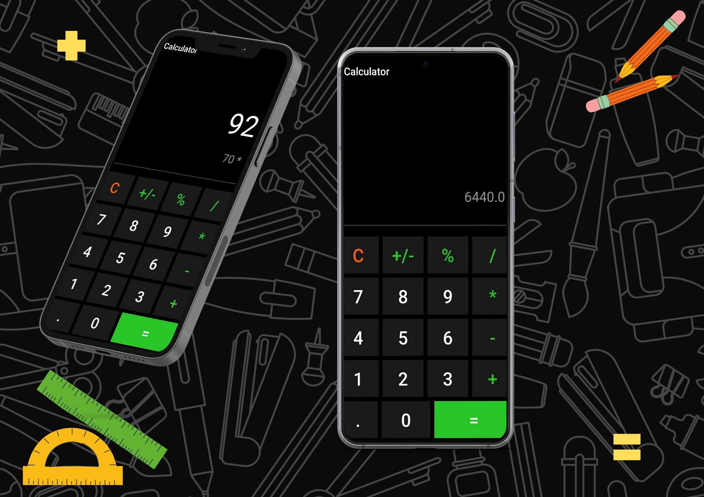

<!-- PROJECT LOGO -->
 

  <h2 align="center">Basic Calculator App</h2>

<!-- ABOUT THE PROJECT -->
### Android Application 

Developed a calculator app that can perform simple operations like addition, subtraction, multiplication, and division.

### Built With
* Java
* Android Studio

  

